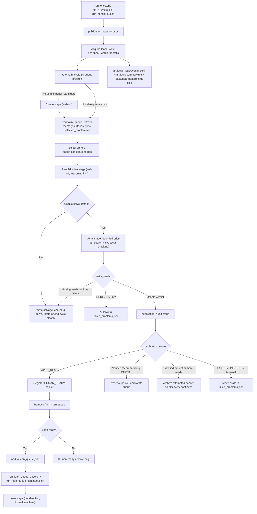

# AutoMath

AutoMath is an automated math-research harness for finding small frontier-novel results that are already close to publishable as short papers.

The repo is currently configured for a strict one-shot publication lane under the `MICRO-PAPER` objective. In plain English, it does not try to win by building a giant campaign. It tries to find the smallest honest open claim where one strong solve is already most of a paper.

Primary success is not merely "proved something exact." The main success condition is a `HUMAN_READY` packet with:

- `verify_verdict = VERIFIED`
- `publication_status = PAPER_READY`
- proof artifacts preserved

Lean-complete `EXACT` is a secondary formal seal, handled in a separate lane after a result is already human-ready.

## What AutoMath Optimizes For

AutoMath strongly prefers targets with all of the following properties:

- the statement is narrow, exact, and source-anchored
- one solve would already look like the title theorem of a short paper
- the remaining writeup after the solve is light
- the rediscovery surface is bounded enough to check honestly
- the theorem slice is stable and does not obviously collapse into a much broader theorem program

It strongly downranks:

- feeder ladders
- broad campaigns
- "cute exact cases" that still are not paper-shaped after the solve
- search-heavy targets unless only a tiny human-readable residue remains
- anything whose key micro-paper fields are unknown or weak

## How The Repo Works

At runtime, AutoMath is a publication supervisor plus a cycle manager:

- `run_once.sh`, `run_n_cycles.sh`, and `run_continuous.sh` call `scripts/publication_supervisor.py`
- the supervisor acquires a repo-local lease, writes heartbeats, watches for stalls, and launches `scripts/automath_cycle.py`
- `scripts/automath_cycle.py` runs the actual publication logic: curation, parallel solve, serial verify, serial publication audit, and the separate Lean queue logic
- stage prompts live in `prompts/`
- candidate-local artifacts live in `artifacts/<slug>/`
- repo-wide memory and queue state live in `queue.json`, `failed_problems.json`, `human_ready.json`, `lean_queue.json`, and `memory/*.json`

The main loop is publication-first. It tries to keep fresh discovery moving even after a human-ready result appears, unless the stop condition is reached and stop markers are enabled.

## Requirements

The current scripts assume:

- `python3`
- the `codex` CLI on `PATH`
- a working Codex login on this machine
- optional Lean tooling via `elan` / `lake` if you want to run the separate formalization lane

The main publication scripts do not bootstrap a Python environment for you. This repo is closer to an execution harness than a packaged library.

## Mermaid Flowchart



## The Five Stages

### 1. `curate`

Curation is not generic idea generation. It is a hard gate for paper-shaped candidates.

The curate stage:

- uses web search
- builds or refreshes `queue.json`
- targets a live queue of five curated dossiers, with live entries expected to be `paper_candidate`s
- aims for a queue of live `paper_candidate` entries
- writes `selected_problem.md`
- refreshes thin memory surfaces such as `memory/paper_memory.json`, `memory/search_memory.json`, `memory/attempt_registry.json`, and `memory/source_registry.json`

Every viable queue entry needs a strong publication packet, not just a problem statement. In practice, each `paper_candidate` is expected to include fields such as:

- `paper_leverage_score`
- `single_solve_to_paper_fraction`
- `title_theorem_strength`
- `family_anchor_strength`
- `publication_narrative_strength`
- `editorial_overhead`
- `isolated_exact_case_risk`
- `broader_theorem_implication_risk`
- `search_heavy`
- `certificate_compactness`
- `exact_gap_from_source`
- `micro_paper_lane_eligible`
- a complete `transfer_kit`

The curation gate rejects candidates if, for example:

- `pre_solve_gate` is not an explicit pass
- `micro_paper_lane_eligible` is not an explicit pass
- `single_solve_to_paper_fraction < 0.70`
- the theorem slice is not stable
- the packet still needs a feeder ladder
- the transfer kit is incomplete
- the post-solve publication distance is too long

### 2. `solve`

Solve is the only parallelized live stage.

The cycle manager may launch up to two workers, `solver-A` and `solver-B`, on distinct queued slugs. Solve runs with web disabled. The intended behavior is:

- reasoning first
- code second
- minimal code only when it clarifies or checks the reasoning
- no brute-force or optimization-heavy attack unless the packet justifies it

Before a solve begins, AutoMath creates the candidate-local baseline:

- `artifacts/<slug>/record.md`
- `artifacts/<slug>/status.json`
- `artifacts/<slug>/working_packet.md`

If solve workers run in parallel, each worker gets its own selection and handoff files under `artifacts/<slug>/attempts/`, with a bounded write scope and a short memo describing:

- the exact statement
- why it would be publishable if solved
- allowed files
- stop condition
- output paths

### 3. `verify`

Verify is manager-serial and skeptical by design.

This stage:

- may use bounded web search
- starts with rediscovery/prior-art checking
- then checks whether the claimed slice is actually supported by the artifacts
- may reclassify a candidate as `REDISCOVERY`
- may treat missing verdicts or abnormal exits as infrastructure failures rather than mathematical failures

The repo is conservative here. A rediscovered exact statement is archived and does not count as a frontier success.

### 4. `publication_audit`

Publication audit asks a different question from solve and verify:

"What is the strongest honest publication-facing claim here?"

This stage decides whether the result is:

- `INSTANCE_ONLY`
- `SLICE_CANDIDATE`
- `SLICE_EXACT`
- `PAPER_READY`
- or effectively non-publication-worthy

If the result is verified and `PAPER_READY`, the packet is registered into `human_ready.json`, removed from the main queue, and fresh discovery is allowed to continue.

If the result is verified but not `PAPER_READY`, AutoMath may:

- preserve a theorem-facing `PARTIAL` packet for bounded follow-up
- archive the attempt so the queue can keep moving
- or mark the problem failed / unsuitable / rediscovered

### 5. `lean`

Lean is a separate, non-blocking formalization lane.

The main publication loop does not stop to formalize every good result. Instead:

- `human_ready.json` stores publishable packets
- `lean_queue.json` is derived from human-ready packets that are eligible for formal sealing
- `run_lean_queue_once.sh` and `run_lean_queue_continuous.sh` process that queue independently

This means a result can already count as a success in human publication terms before Lean is complete.

## Scheduling And Selection

AutoMath does not pick the next problem arbitrarily. After curation, the scheduler filters the queue for usable `paper_candidate` entries and then prioritizes them roughly by:

- higher `paper_leverage_score`
- higher `single_solve_to_paper_fraction`
- stronger title theorem / family anchor / narrative
- smaller exact gap from source
- shorter solve-to-publication distance
- stronger packet quality
- lower overhead / lower search burden

Candidates can also be temporarily parked if they hit an infrastructure cooldown. Infrastructure failures are tracked separately from mathematical failures so the harness does not incorrectly archive a theorem because a worker timed out or crashed.

## What Gets Written During A Cycle

The most important runtime surfaces are:

- `queue.json`: current live queue
- `selected_problem.md`: the currently rendered active packet
- `ledger.md`: append-only human-readable action log
- `artifacts/_logs/events.jsonl`: authoritative machine-readable event stream
- `artifacts/summary.md`: current snapshot summary, not full history
- `artifacts/<slug>/record.md`: reasoning-first solve record
- `artifacts/<slug>/status.json`: current status, classification, publication fields, and next action
- `artifacts/<slug>/working_packet.md`: compact packet for the active theorem slice
- `failed_problems.json`: do-not-recur archive, rediscoveries, exact archived cases, and failed attempts
- `human_ready.json`: publishable packets
- `lean_queue.json`: human-ready packets that are eligible for formal sealing
- `memory/paper_memory.json` and `memory/search_memory.json`: thin canonical memory surfaces

The supervisor also maintains runtime control files under `artifacts/_runtime/main_publication/`, including lease and heartbeat state. These are used to prevent overlapping managers and to detect stalls.

## Running AutoMath

Main publication loop:

```bash
./run_once.sh
./run_publication_cycle.sh
./run_once.sh --verbose
./run_n_cycles.sh 5
./run_continuous.sh
```

Lean queue lane:

```bash
./run_lean_queue_once.sh
./run_lean_queue_continuous.sh
```

Advanced direct entrypoints:

```bash
python3 scripts/automath_cycle.py --slug <queued-slug>
python3 scripts/automath_cycle.py --slug <queued-slug> --stop-after solve
python3 scripts/automath_cycle.py --lean-queue
```

`--verbose` is handled by the publication supervisor and prints heartbeat-based progress to the terminal.

`run_publication_cycle.sh` is currently the same single-cycle entrypoint shape as `run_once.sh`.

## Stop Markers

The two continuous lanes use separate stop markers:

- `.stop_harness` stops the main publication runner
- `.stop_lean_queue` stops the continuous Lean queue runner

The main runner can also create `.stop_harness` automatically when a packet reaches the configured publication-ready stop condition.

## Monitoring

If you want to know what AutoMath is doing right now, inspect these files first:

- `artifacts/summary.md` for the current snapshot
- `artifacts/_logs/events.jsonl` for the authoritative timeline
- `selected_problem.md` for the currently active packet
- `queue.json` for what remains live
- `ledger.md` for the plain-English narrative

If the repo "looks idle" but something feels stuck, the supervisor heartbeat and lease files under `artifacts/_runtime/main_publication/` are the next place to inspect.

## Runtime Model Invocation

Each stage is executed by calling the Codex CLI from `scripts/automath_cycle.py`. The stage runner uses `codex exec --ephemeral` with `gpt-5.4`, writes stdout logs under `artifacts/_logs/`, and stores the last stage message separately.

Search is enabled only where the workflow allows it:

- `curate`: search on
- `verify`: search on
- `publication_audit`: search on
- `solve`: search off
- `lean`: search off

For the tuned OpenAI transport profile used by solve, verify, and publication audit, the code can clone `~/.codex/auth.json` into a temporary `HOME` and write a temporary `.codex/config.toml` that points the run at the ChatGPT-backed Codex endpoint. That keeps stage launches self-contained without changing the main shell environment.

## Failure Handling

AutoMath distinguishes mathematical failure from infrastructure failure.

If a worker times out, exits unexpectedly, or fails to write a usable verdict, the repo does not immediately classify the theorem as dead. Instead it can:

- write salvage artifacts under `artifacts/<slug>/salvage/`
- record the strongest recoverable status
- cool the slug down temporarily
- rotate the candidate to the back of the queue

This is a deliberate rule of the harness: broken runtime behavior should not masquerade as a mathematical negative result.

## Practical Mental Model

The easiest way to think about AutoMath is:

1. curate a queue of tiny paper-shaped packets
2. spend bounded parallel effort on the top one or two
3. verify skeptically
4. audit for honest publication status
5. move human-ready packets out of the way so fresh discovery keeps going
6. formalize later, in a separate Lean lane, if that helps seal the packet

This repo is therefore best understood as a publication engine with theorem-proving components, not as a generic proof search sandbox.
